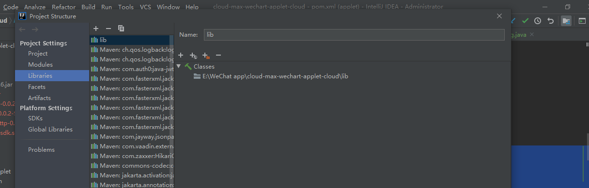

# 中国移动云MAS的后端配置

中国移动云MAS网址:https://mas.10086.cn/login

1. 首先需要以下四个文件

  
在项目目录下新建lib文件夹将四个文件放入  
打开项目配置将lib文件夹包括进去  


2. 添加依赖,plugin中只需要添加`includeSystemScope`

```java
<dependency>
    <groupId>masmgc.sdk</groupId>
    <artifactId>sms</artifactId>
    <version>1.0</version>
    <scope>system</scope>
    <systemPath>${pom.basedir}/lib/original-masmgc.sdk.sms-0.0.1-SNAPSHOT.jar</systemPath>
</dependency>

<plugin>
    <groupId>org.springframework.boot</groupId>
    <artifactId>spring-boot-maven-plugin</artifactId>
    <version>2.3.7.RELEASE</version>
    <configuration>
        <mainClass>com.live.applet.AppletApplication</mainClass>
        <includeSystemScope>true</includeSystemScope>
    </configuration>
    <executions>
        <execution>
            <id>repackage</id>
            <goals>
                <goal>repackage</goal>
            </goals>
        </execution>
    </executions>
</plugin>
```

3. 在application.yml中添加配置
```java
sms:
  # 短信用户名
  sms-user-name: 'synway'
  # 短信服务器地址
  sms-server: 'http://112.35.4.197:15000/'
  # 短信密码
  sms-password: 'Sanhuid@123$%'
  # 短信单位名称
  sms-ec-name: '杭州三汇信息工程有限公司'
  # 短信签名
  sms-sign: 'CBRugzpSQ'
  # 短信验证码模板ID
  code-template-id: '1726ade393624560821facaa9a796248'
```
创建配置获取类
```java

import org.springframework.boot.context.properties.ConfigurationProperties;
import org.springframework.stereotype.Component;

@Component
//接收application.yml中的live-applet下面的属性
@ConfigurationProperties(prefix = "sms")
public class ReadSmsConfig {
    private String smsServer;
    private String smsUserName;
    private String smsPassword;
    private String smsEcName;
    private String smsSign;
    private String codeTemplateId;
    // getter,setter
}
```

4. 验证码生成类
```java

import java.util.Random;

public class GetRandomInfo {
    /**
     * 随机产生字符串
     *
     * @param length 字符串长度
     *
     * @param type 类型 (0: 仅数字; 2:仅字符; 别的数字:数字和字符)
     * @return
     */
    public static String getRandomStr(int length, int type)
    {
        StringBuilder str = new StringBuilder();
        int beginChar;
        int endChar;
        // 只有数字
        if (type == 0)
        {
            beginChar = 'z' + 1;
            endChar = 'z' + 10;
        }
        // 只有小写字母
        else if (type == 2)
        {
            beginChar = 'a';
            endChar = 'z';
        }
        // 有数字和字母
        else
        {
            beginChar = 'a';
            endChar = 'z' + 10;
        }
        // 生成随机类
        Random random = new Random();
        for (int i = 0; i < length; i++)
        {
            int tmp = (beginChar + random.nextInt(endChar - beginChar));
            // 大于'z'的是数字
            if (tmp > 'z')
            {
                tmp = '0' + (tmp - 'z');
            }
            str.append((char) tmp);
        }
        return str.toString();
    }
}
```

5. 服务层接口与实现

```java
package com.live.applet.smsMessage.service;

public interface ISmsMessageService {
    /**
     * 发送验证码
     *
     * @param phoneNumber 手机号
     * @param code 验证码
     * @return 操作结果
     */
    public int sendCode(String phoneNumber, String code);
}
```
实现类
```java
package com.live.applet.smsMessage.service.impl;

import com.live.applet.common.utils.ReadSmsConfig;
import com.live.applet.smsMessage.service.ISmsMessageService;
import com.mascloud.sdkclient.Client;
import lombok.extern.slf4j.Slf4j;
import org.springframework.beans.factory.annotation.Autowired;
import org.springframework.stereotype.Service;
@Service
@Slf4j
public class SmsMessageServiceImpl implements ISmsMessageService {
    private final ReadSmsConfig readSmsConfig;

    @Autowired
    public SmsMessageServiceImpl(ReadSmsConfig readSmsConfig) {
        this.readSmsConfig = readSmsConfig;
    }

    @Override
    public int sendCode(String phoneNumber, String code) {
        Client client = Client.getInstance( );
        String server = readSmsConfig.getSmsServer();
        String userName = readSmsConfig.getSmsUserName();
        String password = readSmsConfig.getSmsPassword();
        String ecname = readSmsConfig.getSmsEcName();
        String sign = readSmsConfig.getSmsSign();
        String codeTemplateId = readSmsConfig.getCodeTemplateId();

        // 登录地址需另外提供
        boolean isLoggedin = client.login( server, userName, password, ecname );
        if( isLoggedin ) {
            log.info("短信验证码服务器登录成功");
        } else {
            log.error("短信验证码服务器登录失败");
            return -1;
        }
        // 普通短信
//        int rt = client.sendDSMS( new String[]{ "15210985914" }, "短信内容", "123", 1, "cwaH21lON", null, true );
//        System.out.println( rt );

        // 模板短信
        int rtm = client.sendTSMS( new String[]{ phoneNumber }, codeTemplateId, new String[]{ code }, "", 0, sign, null );
        if(rtm==1){
            log.info("发送成功");
        }else {
            log.info("发送失败,错误码:"+rtm);
        }
        return rtm;

        // 获取状态报告——开始
//        List<StatusReportModel> statusReportlist = client.getReport( );
//        System.out.println( "getReport : " + JsonUtil.toJsonString( statusReportlist ) );
//        // 获取状态报告——结束
//
//        // 获取上行短信——开始
//        List<MoModel> deliverList = client.getMO( );
//        System.out.println( "getMO : " + JsonUtil.toJsonString( deliverList ) );
        // 获取上行短信——结束

    }
}
```
6. 还可能出现的问题

缺少jar包(内部调用的jar包版本过低的问题)  
引入以下两个包  
  
添加依赖
```java
<dependency>
    <groupId>org.apache.commons</groupId>
    <artifactId>commons-lang2</artifactId>
    <version>2.6</version>
    <scope>system</scope>
    <systemPath>${pom.basedir}/lib/commons-lang-2.6.jar</systemPath>
</dependency>
<dependency>
    <groupId>com.alibaba.fastjson</groupId>
    <artifactId>fastjson</artifactId>
    <version>1.2</version>
    <scope>system</scope>
    <systemPath>${pom.basedir}/lib/fastjson-1.2.78.jar</systemPath>
</dependency>
<dependency>
    <groupId>org.apache.httpcomponents</groupId>
    <artifactId>httpclient</artifactId>
    <version>4.5.2</version>
</dependency>
```